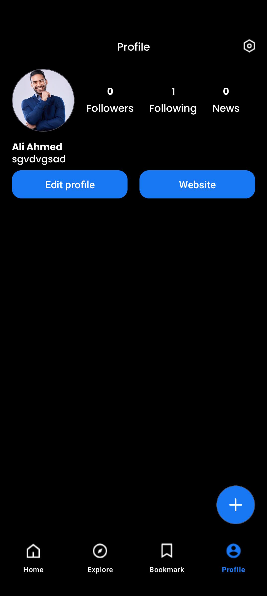

# 📰 NewApp

**NewApp** is a modern Kotlin-based Android news application that allows users to explore, interact with, and manage news content. It supports social features like comments, bookmarks, and follows, with authentication via Google and Facebook. Built using MVVM, Clean Architecture, and Kotlin Coroutines for responsive, asynchronous UI updates.

---

## 📱 Key Screens & Features

- **Onboarding** – First-time user introduction  
- **Sign Up / Login** – Register or sign in via Email, Google, or Facebook  
- **Home Page** – Browse latest and trending news  
- **Search Page** – Search by news, topics, or authors  
- **Detail Page** – View news with:
  - Like / Dislike
  - Bookmark
  - Follow / Unfollow author
  - Open comments section  
- **Comments Page** – Write, like, and reply to comments  
- **Explore Page** – Discover news by topics or trends  
- **Bookmark Page** – Access your saved articles  
- **Profile Page** – View your profile info  
- **Edit Profile Page** – Update avatar, name, and language  
- **Add News Page** – Create your own news with image upload  
- **Followings Page** – List of followed authors  
- **Dark Mode Page** – Toggle dark/light theme  
- **Language Page** – Change app language (i18n)  

---

| Onboarding 1           | Onboarding 2           | Onboarding 3           | Sign Up Page                           |
|-----------------------|-----------------------|-----------------------|--------------------------------------|
|  |  |  |  |

| Login Page             | Home Page              | Trending Page          | Detail Page                          |
|-----------------------|-----------------------|-----------------------|------------------------------------|
|  |  |  |  |

| Comments Page          | Add News               | Display                | Language Switch                    |
|-----------------------|-----------------------|-----------------------|----------------------------------|
|  |  |  |  |

| Profile Page           | Edit Profile           | Explore Page           | Bookmark Page                    |
|-----------------------|-----------------------|-----------------------|--------------------------------|
|  |  |  |  |

| Followings Page        | Search Page            | Settings Page          |                                  |
|-----------------------|-----------------------|-----------------------|----------------------------------|
|  |  |  |                                  |


## 🧠 Technologies Used

| Technology | Purpose |
|------------|---------|
| **Kotlin** | Core programming language |
| **Kotlin Coroutines** | Asynchronous operations, concurrency |
| **MVVM** | Architecture pattern |
| **Clean Architecture** | Layer separation (UI, Domain, Data) |
| **SOLID Principles** | Scalable and maintainable codebase |
| **Material Design 3** | UI and design system |
| **Figma** | Design|
| **Firebase Auth** | Google/Facebook login |
| **Firebase Firestore** | Real-time DB for news and comments |
| **Firebase Storage** | Upload and retrieve images |
| **Room** | Local database (e.g., bookmarks) |
| **Retrofit** | Network layer with coroutine support |
| **Hilt** | Dependency injection |
| **LiveData / StateFlow** | Reactive state management |
| **SharedPreferences** | Save settings (theme, language, login) |
| **Navigation Component** | Fragment navigation and backstack

---

## ⚙️ Core Features

- ✅ Sign in with Email, Google, or Facebook  
- ✅ Like/unlike news, bookmark, follow/unfollow authors  
- ✅ Add comments, like and reply to others  
- ✅ Dark/light mode toggle  
- ✅ Offline support with Room DB  
- ✅ Language switching (internationalization)  
- ✅ Upload profile and news images  
- ✅ Add your own news  
- ✅ Edit profile and settings  

---

## 🧱 Project Architecture

### 🧩 Clean Architecture (with Kotlin Coroutines)

#### 1. **UI Layer**
- Fragments and ViewModels
- Uses `StateFlow` & `LiveData` for reactive UI
- UI ↔ Domain mappers

#### 2. **Domain Layer**
- Use Cases contain business logic
- Pure Kotlin classes
- Suspend functions used for coroutines

#### 3. **Data Layer**
- Repositories for Firebase, Room, Retrofit
- Suspend functions for all data operations
- Coroutine support for asynchronous I/O
- Mappers between data ↔ domain models

---

## 🔁 Coroutine Flow

- Firestore with `callbackFlow` to emit live `Flow<Result<T>>`
- Room DAO uses suspend & Flow for local data
- Retrofit uses suspend network calls
- UseCases handle coroutine logic
- ViewModels collect and expose via `StateFlow`

---

## 🚀 Getting Started

1. Clone the repository:
   ```bash
   git clone https://github.com/yourusername/newapp.git
